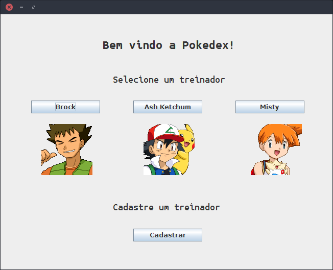

# Pokedex Pokémon


Este Projeto contém um programa feito em **JAVA** capaz de visualizar informações de pokemons obtidas da **The RESTful Pokémon API**.

As principais funcionalidades são:
  - Cadastro de de novos treinadores
  - Associação de pokemons com treinadores
  - Visualização de características de pokemons
  - Listar atributos e habilidades de pokemons
  - Listar todos pokemons de determinado tipo
  - Busca de pokemons pelo nome
  - Visualização dos pokemons

#### Para executar o programa siga os passos abaixo

##### Instale a versão mais recente do Java

###### Debian || Ubuntu || Mint
Siga os passos abaixo
```sh
$ sudo add-apt-repository ppa:webupd8team/java
$ sudo apt-get update
$ sudo apt-get install oracle-java8-installer
$ sudo apt-get install openjdk-8-jdk
```

###### Baixa o jar da aplicação
> [Download do jar](https://gitlab.com/dudurval2/ep2/raw/master/LICENSE?inline=false)

###### Execute o Jar
Abra o terminal no mesmo diretório onde foi baixado o jar e execute o comando:
> `java -jar Pokedex.jar`

#### Uso da aplicação

##### Escolha um treinador ou cadastre um novo


##### Caso tenha escolhido o cadastro, preencha o formulário


##### Pokedex


##### Adicione um novo pokemon


##### Realize uma busca por nome ou por tipo
###### Por nome


###### Por tipo

Aguarde enquanto a busca é realizada

Após encontrar o pokemon desejado, clique 'Capturar Pokemon'

##### Visualize os dados do pokemon capturado


##### Veja as habilidades do pokemon selecionado

Aguarde enquanto as habilidades são carregadas

##### Explore as habilidades e descrições

